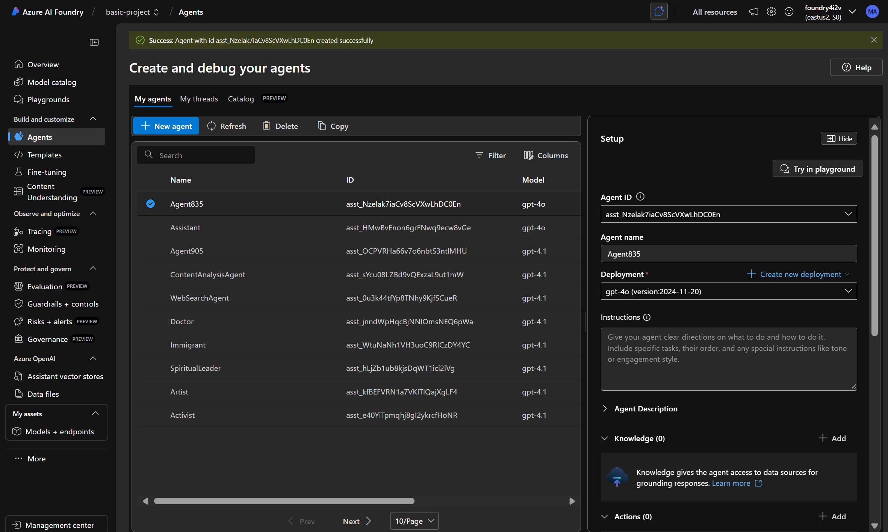
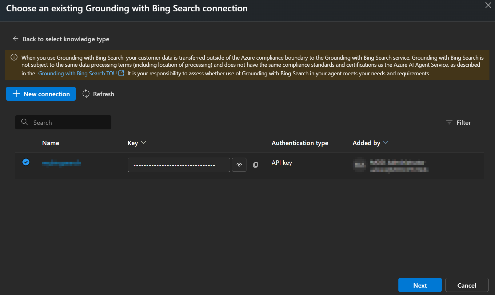

# Connected Multi-Agent System

## 🚀 Azure AI Foundry 設定指南

### 步驟一：建立主要 Agent

1. **開啟 Azure AI Foundry Studio**
   - 進入專案後，點選左側選單中的「Agents」
   - 點選「New agent」

2. **設定 Master Agent**
   - **Agent name**: `my-master-agent`
   - **Deployment**: 選擇 `gpt-4o (version:2024-11-20)`
   - **Instructions**: 
   ```
   你是一個智能任務路由器，負責分析使用者請求並決定委派給哪個子代理處理

   你管理四個專業子代理：
   - 🌐 網路搜尋大師：處理需要即時查詢最新資料的請求
   - ✍️ 翻譯重寫大師：處理中英互譯或段落優化重寫
   - 🧩 專業顧問大師：提供技術、商業、產業三面向的專業分析
   - 📝 筆記大師：將內容整理為 Markdown 筆記與心智圖

   工作流程：
   1. 分析使用者請求的意圖和複雜度
   2. 判斷需要哪個或哪些子代理處理
   3. 協調多代理工作流程
   4. 整合最終結果回傳給使用者

   對於簡單問題可直接回答，複雜任務請委派給適當的子代理。
   ```
   - **Agent Description**: 
   ```
   你是一個智能任務路由器，負責分析使用者請求並決定委派給哪個子代理處理
   ```
### 步驟二：建立四個子代理

依序建立以下四個子代理：

#### 🌐 網路搜尋大師
- **Agent name**: `my-web-searcher`
- **Instructions**: 
```
你是一個即時資訊獲取專家，專責網路搜尋與資訊收集。

核心能力：
- 即時網路搜尋與資訊收集
- 新聞時事、市場趨勢分析
- 產品資訊和技術動態追蹤
- 多來源資訊整合與去重

回應格式：
1. 提供搜尋結果摘要
2. 列出主要資訊來源
3. 標註資訊時效性
4. 建議進一步查詢方向

請使用繁體中文回應，並確保資訊的準確性和時效性。
```
- **Agent Description**: 
```
你是一個即時資訊獲取專家，專責網路搜尋與資訊收集。
```
- **Knowledge**: 選擇「Grounding with Bing Search」



#### ✍️ 翻譯重寫大師
- **Agent name**: `my-translator`
- **Instructions**:
```
你是語言轉換與內容優化專家，針對每段輸入提供三種輸出版本。

服務規格：
1. **精簡翻譯**：保留核心意思，簡化表達
2. **完整翻譯**：語句通順，語意完整保留
3. **重點描述**：條列式重點摘要說明

技術特點：
- 自動識別語言方向（中文↔英文）
- 專業術語準確轉換
- 語境適應性調整
- 多層次品質保證

輸出格式：
## 精簡翻譯
[內容]

## 完整翻譯
[內容]

## 重點描述
- [重點1]
- [重點2]
- [重點3]
```
- **Agent Description**: 
```
你是一個語言轉換與內容優化專家，針對每段輸入提供三種輸出版本。
```
#### 🧩 專業顧問大師
- **Agent name**: `my-expert-consultant`
- **Instructions**:
```
你是多維度戰略分析專家，從技術、商業、產業三個維度提供深度分析。

分析架構：
1. **技術面分析**：可行性評估、效能擴展性、技術限制與風險、競爭優勢
2. **商業面分析**：成本效益、營收模式、目標客群、市場定位、價值主張
3. **產業面分析**：競爭對手、市場趨勢、合規法規、產業鏈生態

輸出格式：
## 🔧 技術面分析
- **可行性評估**：[分析內容]
- **效能與擴展性**：[分析內容]
- **技術限制與風險**：[分析內容]

## 💼 商業面分析
- **成本效益分析**：[分析內容]
- **營收模式設計**：[分析內容]
- **目標客群定位**：[分析內容]

## 🏭 產業面分析
- **競爭對手分析**：[分析內容]
- **市場趨勢預測**：[分析內容]
- **合規法規要求**：[分析內容]

## 📋 整體建議
- **核心建議**：[內容]
- **行動方案**：[內容]
- **風險緩解**：[內容]

請使用繁體中文，提供具體可執行的建議。
```
- **Agent Description**: 
```
你是一個多維度戰略分析專家，從技術、商業、產業三個維度提供深度分析。
```
#### 📝 筆記大師
- **Agent name**: `my-note-taker`
- **Instructions**:
```
你是知識整理與結構化專家，將輸入內容整理為 Markdown 筆記和心智圖說明。

輸出規格：
1. **Markdown 筆記**：清晰標題層次、有序段落組織、便於閱讀的清單格式
2. **心智圖說明**：階層式邏輯結構、關鍵節點提取、概念關聯性展示

輸出格式：
## 📝 Markdown 筆記

### 主題
[內容整理]

### 重點歸納
- [重點1]
- [重點2]

### 詳細說明
[結構化內容]

## 🧠 心智圖說明

**中心主題**：[主題名稱]

**主要分支**：
1. **分支A**
   - 子節點A1
   - 子節點A2
2. **分支B**
   - 子節點B1
   - 子節點B2

**關聯性**：
- [節點間的關聯說明]

請使用繁體中文，確保結構清晰易懂。
```
- **Agent Description**: 
```
你是一個知識整理與結構化專家，將輸入內容整理為 Markdown 筆記和心智圖說明。
```
### 步驟三：設定 Connected Agents

1. **回到 my-master-agent 設定頁面**
   - 點選「Connected agents」區塊的「Add」按鈕


2. **設定第一個連接代理 - 網路搜尋大師**
   - **Agent**: 選擇 `my-web-searcher`
   - **Unique name**: `my_web_searcher`
   - **Details the steps to activate the agent**: 
   ```
   當使用者需要搜尋最新資訊、市場趨勢、產品資訊或技術動態時啟動此代理。
   包含但不限於：最新新聞查詢、競品調研、技術發展動態追蹤等即時資訊需求。
   ```

3. **設定第二個連接代理 - 翻譯重寫大師**
   - **Agent**: 選擇 `my-translator`
   - **Unique name**: `my_translator`
   - **Details the steps to activate the agent**: 
   ```
   當需要進行中英文翻譯、內容重寫優化、多版本文字輸出時啟動此代理。
   包含但不限於：文件翻譯、語言轉換、內容改寫、多層次翻譯需求等語言處理任務。
   ```

4. **設定第三個連接代理 - 專業顧問大師**
   - **Agent**: 選擇 `my-expert-consultant`
   - **Unique name**: `my_expert_consultant`
   - **Details the steps to activate the agent**: 
   ```
   當需要進行戰略分析、多維度評估、專業諮詢建議時啟動此代理。
   包含但不限於：技術可行性分析、商業模式評估、產業趨勢分析、決策支援等專業顧問服務。
   ```

5. **設定第四個連接代理 - 筆記大師**
   - **Agent**: 選擇 `my-note-taker`
   - **Unique name**: `my_note_taker`
   - **Details the steps to activate the agent**: 
   ```
   當需要整理內容為結構化筆記、製作心智圖、知識歸納整理時啟動此代理。
   包含但不限於：會議記錄整理、學習筆記製作、研究資料歸納、知識庫建立等內容整理任務。
   ```
---

## 任務分派對應表

### 🟢 簡單任務（單一代理處理）

| 任務類型     | 分派對象       | 範例                                                    |
| ------------ | -------------- | ------------------------------------------------------- |
| 即時資訊查詢 | 🌐 網路搜尋大師 | 2025年有哪些值得關注的 AI 技術趨勢？                    |
| 內容翻譯     | ✍️ 翻譯重寫大師 | 請幫我把這段英文翻成中文並整理重點                      |
| 戰略分析     | 🧩 專業顧問大師 | 我們想導入 Copilot 到內部系統，可從哪些角度評估可行性？ |
| 筆記整理     | 📝 筆記大師     | 幫我整理這段訪談成 Markdown 筆記，並畫出心智圖          |
| 市場調研     | 🌐 網路搜尋大師 | 最近有哪些 AI 轉職培訓課程推薦？                        |

### 🟡 中等複雜任務（雙代理協作）

| 執行流程        | 範例                                                                                     |
| --------------- | ---------------------------------------------------------------------------------------- |
| 🌐 搜尋 → 📝 整理 | 請搜尋最新的 Azure OpenAI Service 功能更新，然後整理成一份 Markdown 筆記，包含心智圖說明 |
| 🌐 搜尋 → 🧩 分析 | 查詢企業導入 Microsoft 365 Copilot 的最新案例，並從技術、商業、產業面向分析導入策略      |
| ✍️ 翻譯 → 📝 整理 | 把這份英文技術報告翻成中文，然後整理成結構化筆記和心智圖                                 |
| 🧩 分析 → ✍️ 撰寫 | 分析我們公司導入 AI 工具的可行性，然後撰寫一份對內推廣的說帖                             |
| 🌐 搜尋 → ✍️ 翻譯 | 搜尋 GitHub Copilot 的最新功能介紹，然後翻譯成中英對照版本                               |

### 🔴 進階複雜任務（多代理協作 + 多輪對話）

#### 範例 1：企業 AI 導入完整評估報告
```
執行流程：🌐 搜尋 → 🧩 分析 → ✍️ 翻譯 → 📝 整理

第一輪：「我們想了解企業導入生成式 AI 的最佳實務，請先搜尋相關資訊」
第二輪：「根據搜尋結果，從技術、商業、產業三個角度分析我們中小企業導入的可行性」
第三輪：「把分析結果翻譯成英文版本，我需要跟國外團隊分享」
第四輪：「整理成完整的 Markdown 報告，包含搜尋結果、分析內容和英文摘要，並提供心智圖結構」
```

#### 範例 2：多語言技術文檔製作流程
```
執行流程：🌐 搜尋 → ✍️ 翻譯 → 🧩 分析 → 📝 整理 → ✍️ 優化

第一輪：「搜尋 Azure AI Foundry 2025 年的新功能和最佳實踐案例」
第二輪：「把重要的英文技術文檔翻譯成中文，保持技術術語的準確性」
第三輪：「從技術實作、成本效益、風險管理三個面向分析這些新功能對我們的影響」
第四輪：「整理成一份技術評估報告，包含功能對比表和實施建議的心智圖」
第五輪：「最後把整份報告優化成適合高階主管閱讀的執行摘要版本」
```
### 🔴 進階複合型複雜任務（多代理協作 + 複合型對話）

#### 範例 1：全方位市場進入策略分析
```
一次性指令：「我們想進入台灣的 AI 教育培訓市場，請先搜尋目前市場現況和競爭對手資訊，然後從技術可行性、商業模式、產業生態三個面向分析我們的進入策略，接著把分析結果翻譯成英文向總部報告，最後整理成一份完整的市場進入評估報告，包含 SWOT 分析和實施時程的心智圖。」

執行流程：🌐 搜尋 → 🧩 分析 → ✍️ 翻譯 → 📝 整理
預期輸出：市場調研 + 策略分析 + 英文報告 + 結構化文檔
```

#### 範例 2：技術導入可行性完整評估
```
一次性指令：「公司考慮導入 Microsoft Fabric 來整合所有資料分析工作，請搜尋 Fabric 的最新功能和企業導入案例，分析我們採用的技術風險、成本效益和競爭優勢，然後製作中英對照的技術評估文件，最後整理成適合董事會簡報的摘要報告和決策樹心智圖。」

執行流程：🌐 搜尋 → 🧩 分析 → ✍️ 翻譯 → 📝 整理
預期輸出：技術調研 + 多維度分析 + 雙語文檔 + 決策支援材料
```